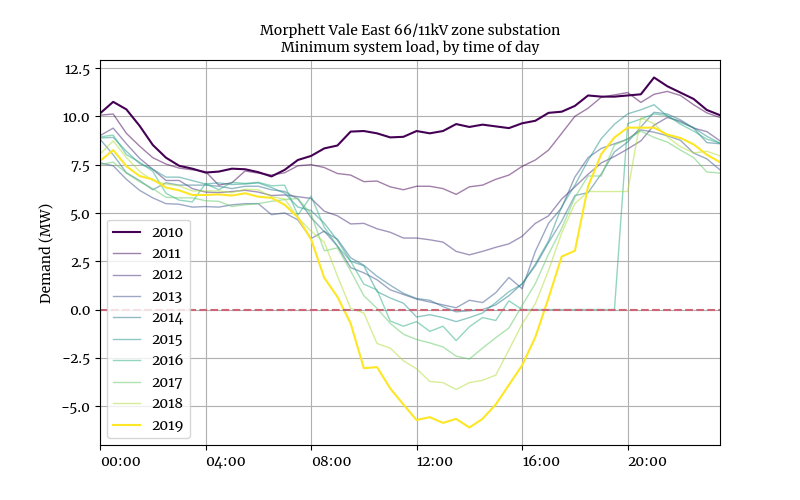

  
```{r setup, include=FALSE}
knitr::opts_chunk$set(message = FALSE)
 
  
```


\pagebreak


### Sunshot Industries {-}

Sunshot Industries  invests capital and know-how in energy intensive businesses  with  the prospect for delivering substantial CO2e abatement.

Sunshot Industries builds on the vision espoused by Ross Garnaut, in his books Superpower and Reset, that Australia could and should take a leading role in the new low carbon economy. 


> *With unparalleled renewable energy resources and the necessary scientific skills, Australia is the natural home for an increasing proportion of global industry in a zero carbon future.*

### Sunshot ZCF {-}

Sunshot ZCF helps Sunshot Industries and its industry and government partners  forge new solutions focussed on the question 

> *How do we make this happen?*

```{r echo=FALSE, out.width="50%", fig.align="center"}

#knitr::include_graphics("./ssi-logo.PNG")
```


\newpage

## Solar justice: Who should pay for the grid? {-}
 
Rooftop solar has been one of the brighter spots in the chequered history of Australia’s climate and energy policy. Australia is at the front of the global pack, with the highest installation per capita. In 2020, a record breaking three gigawatts of rooftop solar was installed in Australia. That is comfortably more than the capacity of our biggest coal generator. Over 2.8 million houses now have solar systems installed. Another four gigawatts is expected to be installed in 2021.

Though it has been a success story, some issues have already arisen with respect to equity, access, and fairness, and some new ones are on the horizon. To date, the financial benefits of rooftop solar have skewed towards high wealth households, while the costs of solar support schemes and some other system costs are disproportionately carried by low wealth households. As the energy transition progresses and the rollout of rooftop solar continues, upgrades will be required or access to solar will become limited, further widening the existing inequalities. The question for policy makers is how to enable the energy transition in a socially just way.

Installing solar represents great value for the homeowners that can access it. This is particularly the case if you maximise the consumption of your own generation. Most obviously, solar reduces the amount of energy that needs to be produced by large centralised power stations. This has a value in dollar terms and carbon terms.

By maximising self consumption, solar owners can also avoid other costs associated with the power system. This includes some of the cost of owning and operating the grid —the poles and wires that transfer electricity across the system. It also includes the cost of some of the environmental subsidy schemes, including those that support rooftop solar. Many of the support schemes are spread across energy users, rather than funded by consolidated revenue.

This may make some sense if solar customers materially contributed less to peak electricity demands, which has historically driven the cost of the poles and wires. However, this is not really the case. As such, some proportion of the private value solar owners derive from their system comes from avoiding the costs associated with shared infrastructure they use and socialised schemes that they benefit from.

This is a problem for those without solar. While non-solar households receive some benefit from the associated emissions reductions and energy generation of others, they are left with a relatively high proportion of the other costs. It is basically a zero-sum game for those costs. If solar customers pay less, everyone else pays more. The cross subsidy from those without solar to those with for the poles and wires alone has been estimated at $3.6billion out to 2030.

This is particularly problematic as is still the case that solar ownership is highly skewed to wealthy demographics. High-wealth households disproportionately receive the benefits (and subsidies) that solar can bring. Home ownership and the upfront costs of solar systems mean that low-wealth households are partly excluded from the benefits of solar, and the opportunity to share socially-funded subsidies.

![Figure 1. Proportion of households with solar installations by wealth decile. 1 is the lowest wealth-decile,   10 is the highest [@BEST2021126618]](figs/wealth-decile.png)


On top of this existing inequity, the rapid and ongoing influx of solar has begun to add new costs. Not only will solar contribute little to reducing peak demand, it might start to drive expansion of infrastructure to allow greater export of solar power, and hence cost. In the immediate term, these costs might be small —but they are still costs. In the near future, more expensive augmentations might be required. Without augmentation or expansion, the alternative is to restrict new solar owners from accessing the grid or exporting electricity to their full potential.

   

This raises all sorts of equity questions. Is it fair for potential new adopters of solar to be locked out of the system? Who should have their solar generation constrained? Or alternatively, should the grid be augmented to allow more solar and equal access to solar, in which case who pays? It seems extremely unjust for those that cannot access or afford solar to foot the bill for those that can.




These issues and questions have been kicking around the electricity sector for close to a decade. In the last 12 months a reform proposal has been co-designed with social service and environment groups and network business to address some of these issues. These have been forcefully resisted by some who have chosen to frame this as a “tax on solar”. The ensuing debate has emphasised individualism and the interests of solar owners, and illustrated a lack of a collective ethic around the rights to electricity, which is an essential service.

This is an important point that is often lost: electricity is an essential service. Historically, in Australia we aimed to socialise the benefits of electricity supply for all citizens. Irrespective of location or the actual cost of bringing electricity to them: price equality is an artefact of the system. The advent of solar raises the prospect of an equal right to produce or export to the grid, which the proposed reforms address. Alongside that right should come a responsibility to contribute to the collective infrastructure.

As it currently stands, the alternative to these reforms is a regressive tax on everyone else, or unfair access to solar. Is that really how we should be progressing the energy transition?

Affordability and accessibility were and remain key objectives for the energy system, and now the climate crisis has added a new dimension. Decarbonisation of the electricity sector should absolutely be prioritised and valued, but in a socially just manner.

Unless solar system owners fairly contribute to the use of the grid, those least able to least able to pay or participate in the energy transition will foot the bill.

 
\newpage

## References {-}

